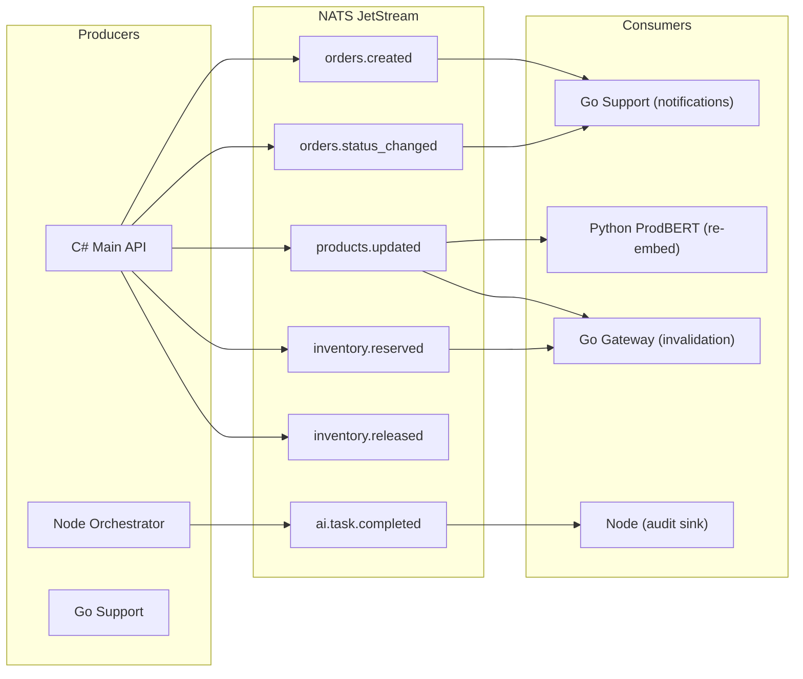

# AI Orchestration & Event-Driven Architecture

## E. AI Orchestration Topology

### Provider Routing

```
Request → Node Orchestrator
  → Provider Selection (priority order):
      1. Gemini (primary)
      2. Cohere (fallback)
      3. Degraded Mode (cached/static response)
  → Execution
  → Audit Log (MongoDB)
  → Result (or graceful degradation)
```

### Provider Fallback Chain

| Priority | Provider | Use Case | Timeout |
|:---|:---|:---|:---|
| 1 | Gemini | Primary reasoning, seller analysis | 10s |
| 2 | Cohere | Fallback generation, summarization | 8s |
| 3 | Degraded | Return cached result or "analysis pending" | 0s |

### Retry Policy

- **Max retries per provider**: 2
- **Backoff**: Exponential (500ms, 1s, 2s)
- **Circuit breaker**: Open after 5 consecutive failures per provider, half-open after 30s
- **Idempotency**: Every AI task carries a unique `task_id`. Re-execution with same `task_id` returns cached result.

### Audit Model

Every AI execution produces a MongoDB document:

```json
{
  "task_id": "uuid",
  "correlation_id": "gateway-correlation-id",
  "provider": "gemini",
  "prompt_hash": "sha256(...)",
  "prompt_tokens": 450,
  "completion_tokens": 280,
  "latency_ms": 2300,
  "status": "success|failure|degraded",
  "reasoning_trace": "...",
  "created_at": "ISO8601"
}
```

### Data Pollution Prevention

Node Orchestrator **MUST NOT** write to PostgreSQL when:
- Provider returns an error
- Provider returns empty/malformed content
- Circuit breaker is open

Instead: log the failure to MongoDB audit, return a typed error to the caller, let the caller decide on retry or degraded UX.

## F. Event-Driven Architecture

### Event Bus: NATS JetStream

Selected for: lightweight footprint, persistence, replay, Go-native client.

### Event Topology



### Outbox Pattern (for C# → NATS)

1. C# writes the business entity **and** an outbox row in a single PostgreSQL transaction
2. A background poller (or WAL-based CDC) reads outbox rows and publishes to NATS
3. On successful publish, marks the outbox row as dispatched
4. This eliminates split-brain between PG commit and event publish

### Saga: Distributed Checkout

```
1. [C# API]  → Create order (status: PENDING) + outbox event
2. [NATS]    → orders.created consumed by Inventory Service
3. [C# API]  → Reserve inventory (status: RESERVED) + outbox event
4. [NATS]    → inventory.reserved consumed by Payment Service
5. [C# API]  → Process payment (status: PAID) + outbox event
6. [NATS]    → orders.status_changed → Go Support (notify user)
```

**Compensation**: If step 5 fails → publish `payment.failed` → Inventory releases reservation → Order status set to CANCELLED.

### Dead Letter Queue

Failed events after 3 retries are routed to `$DLQ.<stream>`. Ops team reviews via dashboard. Events are replayable.

## G. Distributed Transaction Strategy

| Flow | Pattern | Coordinator |
|:---|:---|:---|
| Checkout | Saga (choreography via NATS) | C# API initiates |
| Life Track Sync | Outbox + eventual consistency | Go Support |
| Product Re-embedding | Event-driven async | NATS → ProdBERT |
| Seller Report Generation | Async task queue | Node Orchestrator |
| Audit Logging | Fire-and-forget async | All services → MongoDB |

### Split-Brain Resolution

The current `life_track_sync.go` manual compensation is replaced by:

1. Go Support writes to PostgreSQL **with an outbox row** in a single transaction
2. A NATS publisher reads the outbox and publishes `lifetrack.committed`
3. Redis hot-state update is consumed from the NATS event (eventual consistency)
4. MongoDB audit write is consumed from the NATS event (append-only, idempotent)

If Redis or Mongo are temporarily down, the event remains in NATS and is retried. PostgreSQL (SoR) is always consistent.
