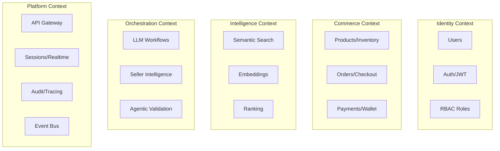

# MyPal Final Target Architecture

> Authoritative architectural blueprint. All implementation must conform to this document.

## A. Bounded Contexts



### Context Ownership

| Bounded Context | Owner Service | Canonical Store |
|:---|:---|:---|
| Identity | C# Main API | PostgreSQL |
| Commerce | C# Main API | PostgreSQL |
| Intelligence | Python ProdBERT | PostgreSQL (pgvector) |
| Orchestration | Node LLM Orchestrator | MongoDB (audit) |
| Platform | Go Gateway + Go Support | Redis (hot) / MongoDB (traces) |

## B. Service Responsibility Matrix

| Service | Owns | Orchestrates | Consumes |
|:---|:---|:---|:---|
| **Go Gateway** | Routing, middleware, correlation IDs, rate limiting, API versioning | Search pipeline, request fan-out | All internal services |
| **C# Main API** | Users, Orders, Products, Inventory, Payments, RBAC | Checkout saga coordination | PostgreSQL |
| **Node Orchestrator** | LLM workflow execution, provider routing | Gemini/Cohere calls, seller reports | ProdBERT, PostgreSQL, MongoDB |
| **Python ProdBERT** | Embedding generation, semantic ranking | Vector inference pipelines | Transformer models |
| **Go Support** | Sessions, realtime, polyglot sync | Cross-store writes, notifications | PostgreSQL, MongoDB, Redis |

## C. Gateway Architecture

### Middleware Chain (ordered)

```
Request → CORS → RateLimit → CorrelationID → InternalTokenValidation
→ JWTValidation → SSQLSanitization → RequestLogging → RouteDispatch
→ ResponseLogging → Response
```

### Route Table

| Route Pattern | Target | Auth | Notes |
|:---|:---|:---|:---|
| `/api/v1/auth/*` | C# `:5000` | None | Public auth endpoints |
| `/api/v1/users/*` | C# `:5000` | JWT | Identity CRUD |
| `/api/v1/products/*` | C# `:5000` | JWT | Catalog operations |
| `/api/v1/orders/*` | C# `:5000` | JWT | Order lifecycle |
| `/api/v1/search` | Gateway-orchestrated | JWT | Multi-service pipeline |
| `/api/v1/ai/*` | Node `:5002` | JWT + Internal | AI workflows |
| `/api/v1/seller-report/*` | Node `:5002` | JWT + Internal | Seller intelligence |
| `/ws/support` | Go Support `:5001` | JWT | WebSocket realtime |
| `/internal/*` | Various | Internal Token only | Service-to-service |

### Observability Contract

Every request receives a `X-Correlation-ID` header. All downstream calls propagate this ID. Gateway logs: method, path, status, latency, correlation ID, upstream service.

## D. Persistence Ownership Matrix

| Data Entity | Canonical Store | Hot Cache | Audit Store |
|:---|:---|:---|:---|
| Users | PostgreSQL | Redis (session) | — |
| Orders | PostgreSQL | Redis (active checkout) | MongoDB |
| Products | PostgreSQL | Redis (catalog cache) | — |
| Inventory | PostgreSQL | Redis (reservation locks) | — |
| Transactions | PostgreSQL | — | MongoDB |
| Embeddings | PostgreSQL (pgvector) | Redis (query cache) | — |
| Seller Summaries | PostgreSQL | Redis (TTL cache) | MongoDB |
| AI Reasoning | — | — | MongoDB |
| Agent Logs | — | — | MongoDB |
| Sessions | — | Redis | — |
| Life Track | PostgreSQL | Redis (hot narrative) | MongoDB |

### Persistence Rules

1. **Write path**: Business writes always hit PostgreSQL first. Redis/Mongo are populated asynchronously or via outbox.
2. **Read path**: Hot reads from Redis. Cache miss falls through to PostgreSQL.
3. **Audit path**: All mutations to orders/payments produce an append-only audit entry in MongoDB.
